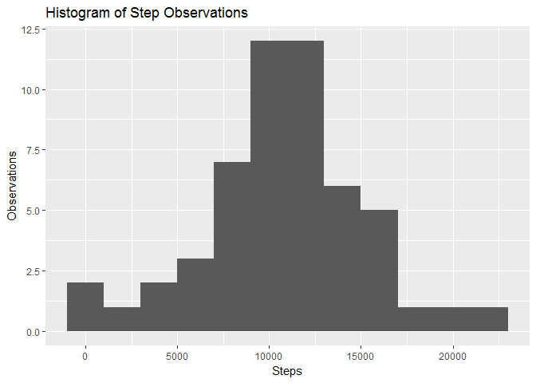
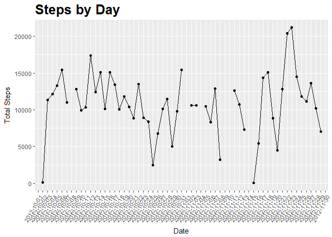
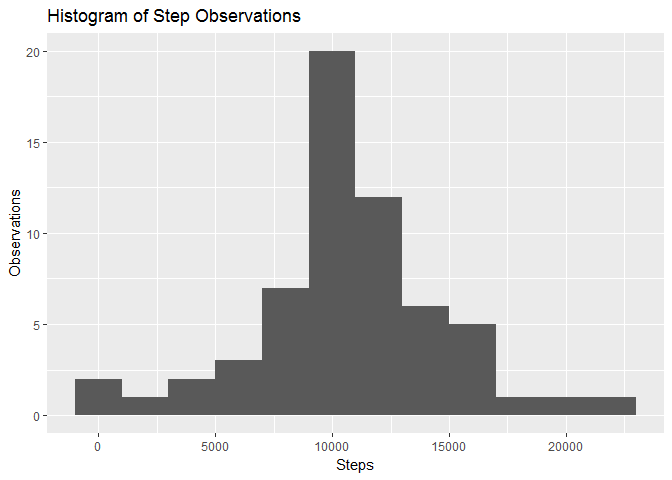
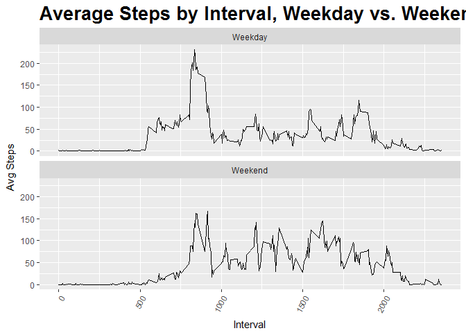

This report analyzes activity data to demonstrate knowledge of R
Markdown for the Reproducible Research class assignment.

Loading the Data
----------------

    library(dplyr)

    ## 
    ## Attaching package: 'dplyr'

    ## The following objects are masked from 'package:stats':
    ## 
    ##     filter, lag

    ## The following objects are masked from 'package:base':
    ## 
    ##     intersect, setdiff, setequal, union

    library(ggplot2)
    library(mosaic)

    ## Loading required package: lattice

    ## Loading required package: ggformula

    ## Warning: package 'ggformula' was built under R version 3.4.1

    ## 
    ## New to ggformula?  Try the tutorials: 
    ##  learnr::run_tutorial("introduction", package = "ggformula")
    ##  learnr::run_tutorial("refining", package = "ggformula")

    ## Loading required package: mosaicData

    ## Warning: package 'mosaicData' was built under R version 3.4.1

    ## 
    ## The 'mosaic' package masks several functions from core packages in order to add 
    ## additional features.  The original behavior of these functions should not be affected by this.
    ## 
    ## Note: If you use the Matrix package, be sure to load it BEFORE loading mosaic.

    ## 
    ## Attaching package: 'mosaic'

    ## The following objects are masked from 'package:dplyr':
    ## 
    ##     count, do, tally

    ## The following objects are masked from 'package:stats':
    ## 
    ##     binom.test, cor, cor.test, cov, fivenum, IQR, median,
    ##     prop.test, quantile, sd, t.test, var

    ## The following objects are masked from 'package:base':
    ## 
    ##     max, mean, min, prod, range, sample, sum

    library(xtable)
    library(knitr)

1.  Code for reading in the dataset and/or processing the data

<!-- -->

    d<- read.csv(file="c:/Users/bh17649/Documents/Data_Science/Course Notes/Reproducible Research/Class Projects/activity.csv", header=TRUE, sep=",", stringsAsFactors = FALSE)
    names(d)

    ## [1] "steps"    "date"     "interval"

    head(d)

    ##   steps       date interval
    ## 1    NA 2012-10-01        0
    ## 2    NA 2012-10-01        5
    ## 3    NA 2012-10-01       10
    ## 4    NA 2012-10-01       15
    ## 5    NA 2012-10-01       20
    ## 6    NA 2012-10-01       25

    nrow(d)

    ## [1] 17568

    ncol(d)

    ## [1] 3

1.  Histogram of the total number of steps taken each day

<!-- -->

    #Calculate by day
    s<- d %>% group_by(date) %>% summarize(total_steps = sum(steps))
    p<- ggplot(s, aes(total_steps))

    p + geom_histogram(binwidth = 2000) + xlab("Steps") + ylab("Observations") + labs(title = "Histogram of Step Observations")

    ## Warning: Removed 8 rows containing non-finite values (stat_bin).

1.  Mean and median number of steps taken each day

<!-- -->

    #Check Mean, Median and Quartile results by day
    summ<- s %>% summarize(mean_steps = mean(total_steps, na.rm=TRUE), median_steps=median(total_steps, na.rm=TRUE))
    summ

    ## # A tibble: 1 x 2
    ##   mean_steps median_steps
    ##        <dbl>        <int>
    ## 1   10766.19        10765

1.  Time series plot of the average number of steps taken

<!-- -->

    d<- as.data.frame(d)
    d$date2<- as.character(d$date)
    d$date2<- as.Date(d$date)

    ggplot(s, aes(date, total_steps, group=1)) +
               geom_point() +
               geom_line() +  
               ggtitle("Steps by Day") +
               xlab("Date") + ylab("Total Steps")  +
               theme(plot.title = element_text(lineheight=.8, face="bold", 
                                              size = 20)) +
               theme(axis.text.x = element_text(angle=60, hjust=1))

    ## Warning: Removed 8 rows containing missing values (geom_point).

    ## Warning: Removed 2 rows containing missing values (geom_path).

1.  The 5-minute interval that, on average, contains the maximum number
    of steps

<!-- -->

    i<- d %>% select(interval, steps) %>% group_by(interval) %>% summarize(avg_steps = mean(steps, na.rm = T))

    i<- arrange(i, desc(avg_steps))

    kable(head(i))

<table>
<thead>
<tr class="header">
<th align="right">interval</th>
<th align="right">avg_steps</th>
</tr>
</thead>
<tbody>
<tr class="odd">
<td align="right">835</td>
<td align="right">206.1698</td>
</tr>
<tr class="even">
<td align="right">840</td>
<td align="right">195.9245</td>
</tr>
<tr class="odd">
<td align="right">850</td>
<td align="right">183.3962</td>
</tr>
<tr class="even">
<td align="right">845</td>
<td align="right">179.5660</td>
</tr>
<tr class="odd">
<td align="right">830</td>
<td align="right">177.3019</td>
</tr>
<tr class="even">
<td align="right">820</td>
<td align="right">171.1509</td>
</tr>
</tbody>
</table>

1.  Code to describe and show a strategy for imputing missing data

<!-- -->

    #Replace missing values with average for the interval
    d$steps2<- d$steps

    i<- d %>% 
            group_by(interval) %>% 
            mutate(steps2 = replace(steps2, is.na(steps), mean(steps, na.rm=TRUE)))

    #Checck original and new variable to ensure all missing values are gone.
    kable(favstats(i$steps))

<table>
<thead>
<tr class="header">
<th></th>
<th align="right">min</th>
<th align="right">Q1</th>
<th align="right">median</th>
<th align="right">Q3</th>
<th align="right">max</th>
<th align="right">mean</th>
<th align="right">sd</th>
<th align="right">n</th>
<th align="right">missing</th>
</tr>
</thead>
<tbody>
<tr class="odd">
<td></td>
<td align="right">0</td>
<td align="right">0</td>
<td align="right">0</td>
<td align="right">12</td>
<td align="right">806</td>
<td align="right">37.3826</td>
<td align="right">111.9955</td>
<td align="right">15264</td>
<td align="right">2304</td>
</tr>
</tbody>
</table>

    kable(favstats(i$steps2))

<table>
<thead>
<tr class="header">
<th></th>
<th align="right">min</th>
<th align="right">Q1</th>
<th align="right">median</th>
<th align="right">Q3</th>
<th align="right">max</th>
<th align="right">mean</th>
<th align="right">sd</th>
<th align="right">n</th>
<th align="right">missing</th>
</tr>
</thead>
<tbody>
<tr class="odd">
<td></td>
<td align="right">0</td>
<td align="right">0</td>
<td align="right">0</td>
<td align="right">27</td>
<td align="right">806</td>
<td align="right">37.3826</td>
<td align="right">105.3248</td>
<td align="right">17568</td>
<td align="right">0</td>
</tr>
</tbody>
</table>

1.  Histogram of the total number of steps taken each day after missing
    values are imputed

<!-- -->

    s<- i %>% group_by(date) %>% summarize(total_steps = sum(steps2))
    p<- ggplot(s, aes(total_steps))

    p + geom_histogram(binwidth = 2000) + xlab("Steps") + ylab("Observations") + labs(title = "Histogram of Step Observations")

8. Panel plot comparing the average number of steps taken per 5-minute
interval across weekdays and weekends

    i$dayofweek <- weekdays(as.Date(d$date))
    i$weekend_flg<-i$dayofweek
    i<- i %>%  
         mutate(weekend_flg = ifelse((dayofweek == "Sunday" | dayofweek == "Saturday"), "Weekend",  "Weekday"))

    i<- i%>% select(weekend_flg, interval, steps2) %>%
            group_by(interval, weekend_flg) %>%
            summarize(avg_steps= mean(steps2))

    p<- ggplot(i, aes(interval, avg_steps, group=1))

    p+         geom_line() +  
               ggtitle("Average Steps by Interval, Weekday vs. Weekend") +
               xlab("Interval") + ylab("Avg Steps")  +
               theme(plot.title = element_text(lineheight=.8, face="bold", 
                                              size = 20)) +
               theme(axis.text.x = element_text(angle=60, hjust=1)) +
               facet_wrap(~ i$weekend_flg, ncol=1)

1.  All of the R code needed to reproduce the results (numbers,
    plots, etc.) in the report

See above :)!
=============
